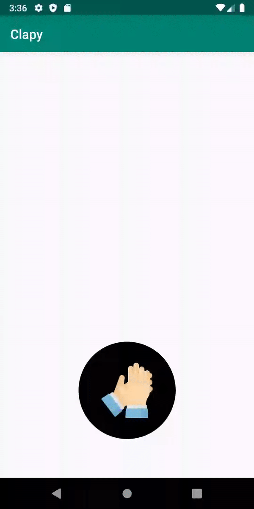

# Clapy
An android app that shows various animations. Below are the features of app
- Create a button with clap hands icon with a circle black background
- When there are more than 1 claps, show a blue stroke around the circumference of the circle to indicate percent #number_claps/ 100.
- On click, animate the clap icon to quickly expand and shrink back to the original size smoothly
- On click, update the blue stroke position based on new count
- On click, create a new clap icon somewhere on screen, animate to a different fixed or relative x/y position, along a non-straight path, and remove it. Best if not using Canvas, best if works on Android 16+

Please see below for animations

